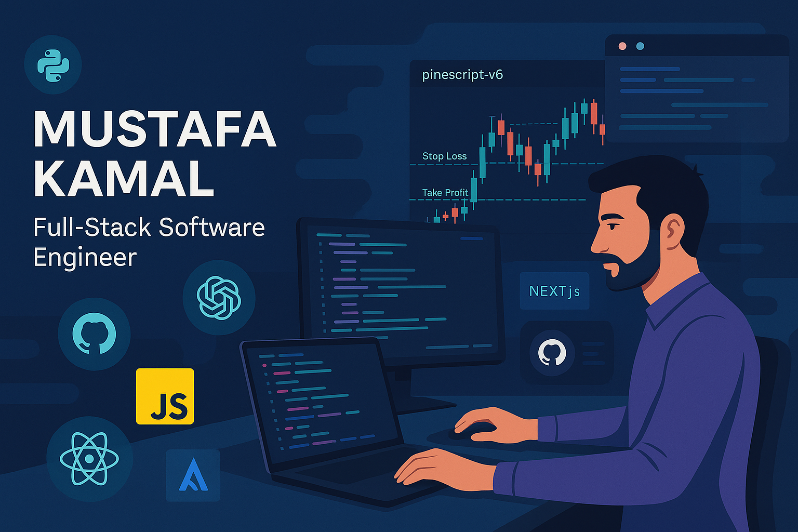

<!-- Banner Image -->

# Hi, I'm Mustafa Kamal 👋  

💻 **Full-Stack Software Engineer** & **Trading Automation Developer** with 6+ years of experience delivering high-performance applications for mobile, web, and cross-platform environments.  
📈 Passionate about **clean code, scalable architecture, and market automation**.  
🌍 Based in the UK, working globally.

---

## 🚀 What I Do
- **Mobile Development:** Android (Kotlin, Java), Kotlin Multiplatform, Jetpack Compose  
- **Web Development:** ReactJS, Next.js, HTML5, CSS3, JavaScript (ES6)  
- **Backend & APIs:** ASP.NET Core MVC, Firebase, MongoDB, MySQL, SQLite  
- **Trading Automation:** NinjaTrader (C#), Pine Script v6, broker APIs (Binance, Tradovate, Interactive Brokers)  
- **Cloud & DevOps:** Docker, GitHub Actions, AWS, Vercel  
- **Practices:** Clean Architecture, SOLID principles, Agile/Scrum, SDLC, QA

---

## 📊 Current Focus (2025–2026)
- Building **SaaS trading analytics tools**  
- Cross-platform mobile apps using **Kotlin Multiplatform**  
- Low-latency market data & automated strategies  
- Writing and sharing **technical content** on Medium

---

## 🎓 Education
- **MSc Computer Science** – Edinburgh Napier University, 2024  
- **BSc Computer Science** – University of Agriculture Peshawar (IBMS), 2017  

---

## 🌐 Connect
  
  
  
📧 Email: **m.sadaat88@gmail.com**

---

## 📈 GitHub Insights
  
  

---

💡 *"Great software is built at the intersection of creativity, logic, and execution."*
